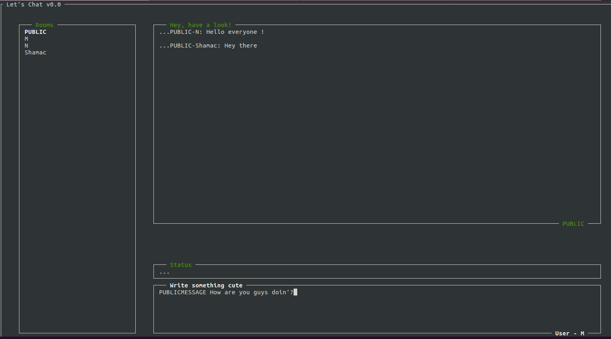

# Lets Chat
A very simple chat made with Python.

## Requirements

* Python >= 3.5.2
* npyscreen
* setuptools
* pydoc [if you want to generate the documentation]
* curses

### NPYSCREEN & SETUPTOOLS

If neccesary NPYSCREEN and SETUPTOOLS can be downloaded via ```PIP3```.
If you already have setuptools installed then you can run: ```./setup install```.
And it should add a ```.pth``` file so that it can be installed via ```easy-install```

### CURSES
It should be available by default since ```python 3.5.2``` but in case it isn't in your system
you can install it via ```PIP3```.

## BUILD AND RUN
### Client Side
NPYSCREEN is an user interface that's located in the terminal, so there aren't any annoying windows that
invade your screen. It all runs in the terminal. To run the program use:
```
python3 -m src.main_client
```

### Client Screenshots



### Server Side
* You can bind it to an specific host using the ```-b``` flag
* Specify the number of connections
* Debug Mode available use the ```-d``` flag

```
python3 -m src.main_server [-b host] port number_of_conections [-d]
```
Debug mode can be use to see the status of the server, see how it responds to the events that multiple users
send and check whether or not the server behaves as it should be (even though that's the reason why the unit
tests exist.)

## UNIT TESTS
To run the unit tests run the following command:
```
./setup test
```

### Author
* Mauricio Carrasco Ruiz
